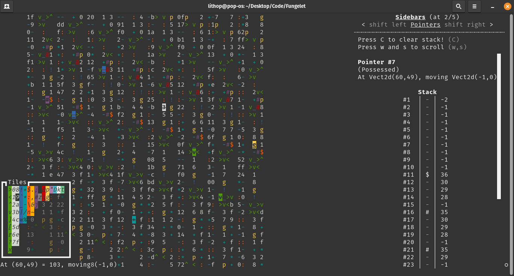

# Fungelet, a very convenient befunge IDE
## Screenshot


## Installation
```bash
git clone https://github.com/lomnom/Fungelet/
cd Fungelet
git clone https://github.com/lomnom/Terminal/
mv Terminal/Term*.py .
rm -rf Terminal
pip3 install pyyaml
python3 Run.py -h
```
- Works on Mac and linux natively
- Tested in WSL (use a good terminal tho)

## Usage
Tutorial & demonstration [here](https://drive.google.com/file/d/1Y6eSMXU-D9mOoyFb6qI2bblmdH0TOXCX/view?usp=sharing)

Features of this include:
- Cut, paste, chunk delete and rotate
- Quick instruction reference
- Seeing the pointers and plane evolve live, right in front of your eyes
- An input system built for productivity
- Visualising non-ascii characters as coloured boxes
- Negative regions are as accessible as positive ones
- Concurrency is easy and natural
- And many more quality of life features, on top of an almost entirely compliant implementation of befunge.

#### Note: It is strongly recommended to follow along with the hands-on guide by running `python3 Run.py -h`!
befunge examples [here](http://www.nsl.com/k/befunge93/index.html). astolfo [here](https://gist.github.com/lomnom/5db8fdd517dc7e57c4aada340ef87ada)

## (Dev) Documentation 
Please feel free to contact me at `zhaoxiong.ang@gmail.com` for any queries and explanations related to this application's code!
